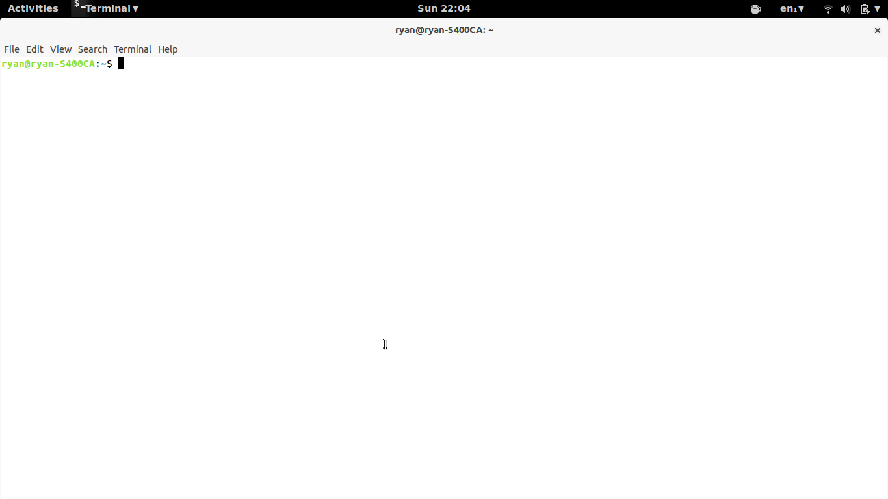

Tin v0.1.0
=====================================

 </img>

Tin (Time Interval, or Time In) is a command-line tool that performs one simple, annoyingly
common calculation: it finds the time in a set amount of time. This type of
calculation frequently comes up when timing dinners, downloads and other mundane
things.

### Usage

```
tin 8.5 hours
tin 12 minutes
tin 8.5 hours
```


### Requirements.

* Ubuntu, or possibly another Linux distribution (tested on Ubuntu 13.10)
* Node.js >= 10.28
* Docopt

### Installation.

#### - Dependencies

To install node.js on Ubuntu use

```
sudo add-apt-repository ppa:chris-lea/node.js
sudo apt-get update
sudo apt-get install nodejs
```

Tin depends on docopt to read arguments from the command-line.

```
sudo npm install -g docopt
```

#### - Tin

Grab the repository from github:

```bash
git clone https://github.com/rgrannell1/tin
cd tin
```

Run the following command:

```bash
sudo nano ~/.bashrc
```
add the line,

```bash
alias tin=path/to/tin.py
```

Run

```
. ~/.bashrc
```

and you're ready to go. Now you can test the program with

```
tin 0.5 hours
```

### Licence

The MIT License

Copyright (c) 2014 Ryan Grannell

Permission is hereby granted, free of charge, to any person obtaining a copy of this software and associated documentation files (the "Software"), to deal in the Software without restriction, including without limitation the rights to use, copy, modify, merge, publish, distribute, sublicense, and/or sell copies of the Software, and to permit persons to whom the Software is furnished to do so, subject to the following conditions:

The above copyright notice and this permission notice shall be included in all copies or substantial portions of the Software.

THE SOFTWARE IS PROVIDED "AS IS", WITHOUT WARRANTY OF ANY KIND, EXPRESS OR IMPLIED, INCLUDING BUT NOT LIMITED TO THE WARRANTIES OF MERCHANTABILITY, FITNESS FOR A PARTICULAR PURPOSE AND NONINFRINGEMENT. IN NO EVENT SHALL THE AUTHORS OR COPYRIGHT HOLDERS BE LIABLE FOR ANY CLAIM, DAMAGES OR OTHER LIABILITY, WHETHER IN AN ACTION OF CONTRACT, TORT OR OTHERWISE, ARISING FROM, OUT OF OR IN CONNECTION WITH THE SOFTWARE OR THE USE OR OTHER DEALINGS IN THE SOFTWARE.

### Versioning

Versioning complies with the Semantic Versioning 2.0.0 standard.

http://semver.org/
